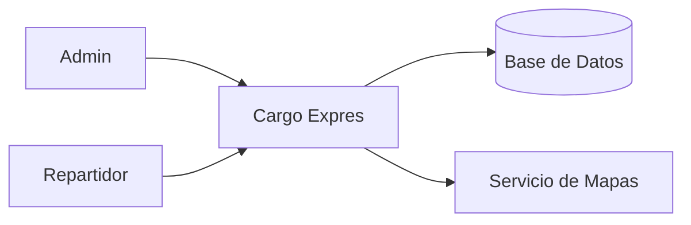

# System Brief – Cargo Expres

## Visión
Optimizar rutas de entrega para pequeñas empresas.

## Problema
Planificación manual genera pérdidas de tiempo y combustible.

## Stakeholders
- Administrador
- Repartidor
- Empresa
- Cliente

## Scope
- Registro de paquetes
- Cálculo de ruta óptima
- Visualización en mapa
- Autenticación

## No-Scope
- Pagos
- GPS en tiempo real
- App móvil

## Diagrama de Contexto

